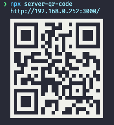
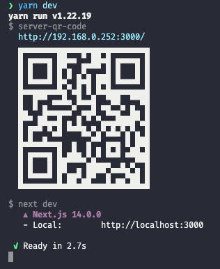

# server-qr-code

Shows QR code of server url.



## Installation

```bash
npm install --save-dev server-qr-code
```

## Usage

### standalone

```bash
npx server-qr-code
```

### with Next.js

```diff
"scripts": {
+ "predev": "server-qr-code",
  "dev": "next dev",
  "build": "next build",
+ "prestart": "server-qr-code",
  "start": "next start",
  "lint": "next lint"
},
```



If you're using Vite, you should use [vite-plugin-qrcode](https://github.com/svitejs/vite-plugin-qrcode/tree/main).

## Options

Options are the same as `next dev` and `next start`.

```bash
Options
  --port, -p      A port number (default: 3000)
  --hostname, -H  Hostname
  --help          Displays this message
```

## License

[MIT](./LICENSE)
